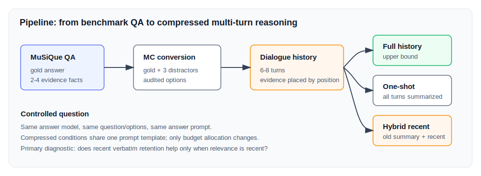
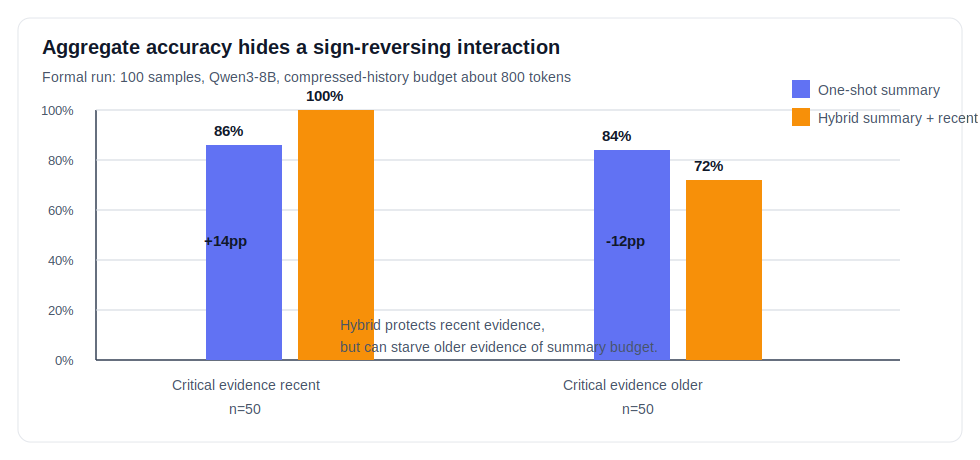

# 6分钟NLP课堂汇报：Keep Recent or Keep Relevant?

## 0. 汇报标题

**Keep Recent or Keep Relevant? Position-Dependent Trade-offs in Prompt-Based Compression of Multi-Turn Reasoning Histories**

一句话概括：

> 在固定历史压缩预算下，保留最近轮次原文并不总是更好；它会在“关键信息最近”时显著帮助，在“关键信息较早”时反而损害多轮推理。

建议开场白：

> 今天我汇报的是一个多轮推理历史压缩的小实验。很多 LLM 系统会把早期对话压缩成摘要，同时保留最近一轮原文，因为最近信息通常被认为更重要。但我的问题是：如果真正决定答案的证据并不在最近一轮，这种 recency-biased 的压缩策略还可靠吗？

---

## 1. 研究问题：最近不一定等于相关

**核心问题**

在多轮问答或 agent 系统中，对话历史会不断增长。常见做法是：

- 把全部历史一次性总结成摘要；
- 或者总结较早历史，同时保留最近一轮原文。

本研究问的是：

> 在相同压缩预算、相同压缩提示词下，保留最近轮次原文究竟是提升多轮推理，还是引入一种位置依赖的取舍？

这个问题的关键不是“prompt 怎么写得更好”，而是**固定历史预算如何分配**：

| 策略 | 历史表示 | 直觉优势 | 潜在风险 |
|---|---|---|---|
| `full_history` | 完整对话历史 | 信息最完整 | 输入成本最高 |
| `one_shot_summary` | 全部历史一次性压缩 | 全局视野完整 | 可能漏掉局部关键事实 |
| `hybrid_summary_recent` | 旧历史摘要 + 最近一轮原文 | 保护最近信息 | 旧历史摘要预算变小，近期干扰也被保留 |

讲法提示：

> 这里我把 full history 当作上界，不参与压缩策略比较。真正要比较的是 one-shot 和 hybrid。它们用同一个 Qwen3-8B 模型、同一个压缩 prompt、同样约 800 token 的压缩历史预算；唯一变化是历史预算的分配方式。

---

## 2. 数据与实验设计

**数据来源**

- 主数据集：MuSiQue-Ans，多跳问答 benchmark。
- 每个样本包含：gold answer、2-4 个 supporting evidence、reasoning-hop decomposition。
- 原始开放问答被转换成 4 选 1 multiple-choice QA：1 个 gold option + 3 个 LLM 生成 distractors。

**多轮历史构造**

每个 benchmark item 被转换成 6-8 轮 source-note collection dialogue：

- 用户轮次按位置注入关键证据和 distractors；
- assistant 使用自然中间推理风格，只能讨论当前可见 note；
- 最终问题和选项在对话阶段隐藏，只在最后回答阶段出现。

**证据位置控制**

| Profile | 关键信息位置 | 目的 |
|---|---|---|
| `far_early` | 早期轮次 | 测试旧证据是否会被压缩丢失 |
| `far_middle` | 中间轮次 | 测试非最近证据的保存 |
| `cross_turn` | 跨早/中/晚多轮 | 测试多证据串联 |
| `late` | 靠近末尾 | 测试 recent retention 的优势 |

正式实验设置：

| 项目 | 设置 |
|---|---|
| 样本数 | 100 个正式样本 |
| 条件数 | 3 个条件，共 300 次推理 |
| Answer model | Qwen3-8B, thinking enabled |
| Summarizer | 同一 Qwen3-8B, thinking disabled |
| 压缩历史预算 | 约 800 tokens |
| Thinking budget | 512 tokens |
| 主要指标 | Final-answer accuracy |

讲法提示：

> 一个设计重点是我记录了 `critical_evidence_in_recent_turn`，也就是答案关键证据是否落在 hybrid 会原文保留的最近窗口内。这样就能区分：hybrid 是真的整体更强，还是只在 relevance 和 recency 对齐时更强。

---

## 3. 主结果：总准确率几乎一样，但分层后方向相反

整体结果看起来差别很小：

| Condition | Correct / Total | Accuracy |
|---|---:|---:|
| `full_history` | 100 / 100 | 100% |
| `one_shot_summary` | 85 / 100 | 85% |
| `hybrid_summary_recent` | 86 / 100 | 86% |

如果只看总准确率，会得到一个很弱的结论：hybrid 只比 one-shot 高 1 个百分点。

但按关键证据是否在最近窗口内分层后，结果完全不同：

| Evidence placement | One-shot | Hybrid | Hybrid gap |
|---|---:|---:|---:|
| Critical evidence in recent window | 43 / 50 = 86% | 50 / 50 = 100% | **+14pp** |
| Critical evidence outside recent window | 42 / 50 = 84% | 36 / 50 = 72% | **-12pp** |

核心结论：

> hybrid 的效果不是小，而是被 aggregate 平均掉了。它在 recent-relevant 情况下大幅提升，在 old-relevant 情况下明显下降，形成 26pp 的条件性摆动。

讲法提示：

> 这张图是整个汇报最重要的图。左边说明 hybrid 的最近原文窗口确实有价值：当答案证据刚好在最近一轮，它直接保住了证据，所以达到 100%。右边说明这个策略不是免费午餐：当关键证据在较早轮次，hybrid 只给旧历史约 550 token 的摘要预算，比 one-shot 更容易漏掉旧证据，同时最近原文还可能带入 distractor。

---

## 4. 按 evidence profile 看：架构效果随位置翻转

| Profile | Full | One-shot | Hybrid | Hybrid - One-shot |
|---|---:|---:|---:|---:|
| `cross_turn` | 100% | 88% | 100% | **+12pp** |
| `late` | 100% | 84% | 100% | **+16pp** |
| `far_middle` | 100% | 88% | 76% | **-12pp** |
| `far_early` | 100% | 80% | 68% | **-12pp** |

这说明：

- 当证据靠后或跨轮次且最近窗口包含关键证据时，hybrid 更强；
- 当证据主要在早期或中间时，one-shot 更稳；
- full history 100% 表明样本本身可答，压缩才是主要性能瓶颈。

讲法提示：

> 这不是某个模型答题能力不够的问题，因为 full history 全部答对了。真正被诊断出来的是历史表示的问题：压缩后留下来的信息结构改变了模型后续推理的可用证据。

---

## 5. 机制分析：失败主要来自证据遗漏

对 22 个关键 compressed-condition failure 做人工标注：

| Failure group | Count | Critical evidence recent | Critical evidence older |
|---|---:|---:|---:|
| One-shot wrong, Hybrid right | 8 | 7 | 1 |
| Hybrid wrong, One-shot right | 7 | 0 | 7 |
| Both wrong | 7 | 0 | 7 |

机制分布：

| Mechanism | Count | Percentage |
|---|---:|---:|
| Evidence omitted | 14 | 64% |
| Distractor overweighted | 4 | 18% |
| Recent distractor interference | 2 | 9% |
| No major compression loss | 2 | 9% |

解释：

- one-shot 错、hybrid 对：多数发生在关键证据最近，hybrid 通过原文保留救回答案；
- hybrid 错、one-shot 对：全部发生在关键证据不最近，hybrid 的旧历史摘要预算不足；
- 两者都错：也全部是早期/中期证据，说明压缩共同丢失了答案关键事实。

讲法提示：

> 人工标注支持了主结果的机制解释：压缩失败最常见不是模型不会推理，而是答案所需证据没有以足够明确的形式进入最终历史表示。hybrid 的优势和劣势都来自同一个设计：它把预算从旧历史挪给了最近轮次。

---

## 6. 总结与启发

**Takeaways**

1. 最近轮次保留是有用的，但它只在 relevance 和 recency 对齐时可靠。
2. 总准确率会掩盖强烈的 architecture-by-position interaction。
3. 多轮推理历史压缩不应只问“压到多短”，还应问“保留哪个位置、哪类推理状态”。

**对 NLP 系统的启发**

- Conversation memory 不能简单把 recency 当作 relevance。
- 更好的压缩策略应该 evidence-position-aware 或 relevance-aware。
- 后续可以做动态策略：先估计哪些历史片段含有答案关键证据，再决定摘要、原文保留或检索。

建议结束语：

> 所以这个实验的结论不是 hybrid 好或者 one-shot 好，而是：固定预算下的历史压缩是一种信息分配策略。保留最近内容会保护最近证据，也会牺牲较早证据。对于需要跨轮次证据整合的 NLP 任务，真正重要的是让系统保留 relevant reasoning state，而不是默认保留 recent text。

---

## 6分钟时间分配

| 时间 | 内容 |
|---:|---|
| 0:00-0:45 | 背景：多轮历史增长与压缩需求 |
| 0:45-1:40 | 研究问题：recent vs relevant |
| 1:40-2:40 | 数据构造与三种条件 |
| 2:40-4:10 | 主结果：aggregate 掩盖分层反转 |
| 4:10-5:10 | 机制分析：证据遗漏与近期干扰 |
| 5:10-6:00 | 总结：position-aware compression |

## 一页版备忘

- RQ：固定压缩预算下，recent-turn verbatim retention 是否总是提升多轮推理？
- Method：MuSiQue -> MC QA -> 6-8 轮 dialogue -> 3 条件推理。
- Main result：overall one-shot 85%，hybrid 86%，但分层后 hybrid +14pp / -12pp。
- Mechanism：22 个 critical failure 中 evidence omission 占 64%。
- Conclusion：recent retention is conditional; compression should preserve relevant reasoning state, not merely recent text.
